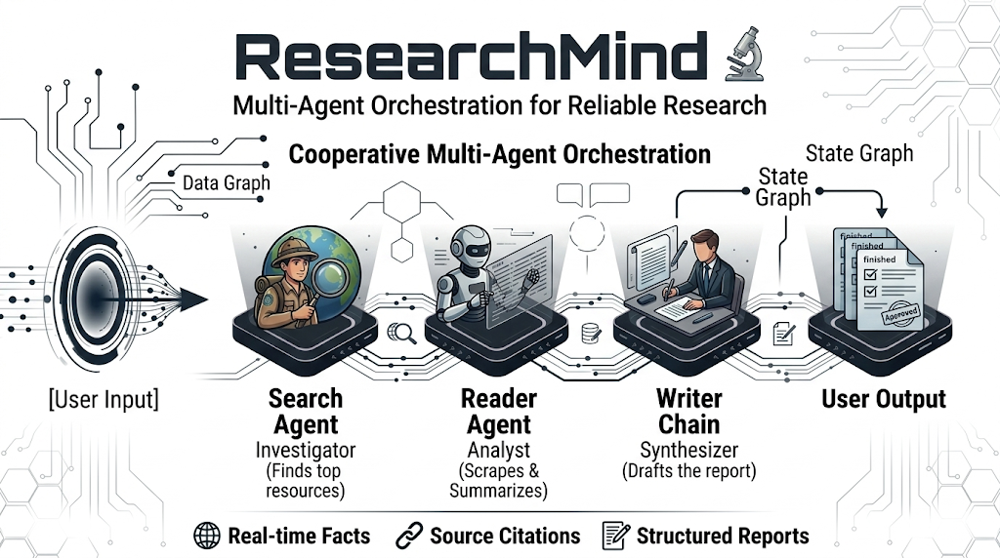
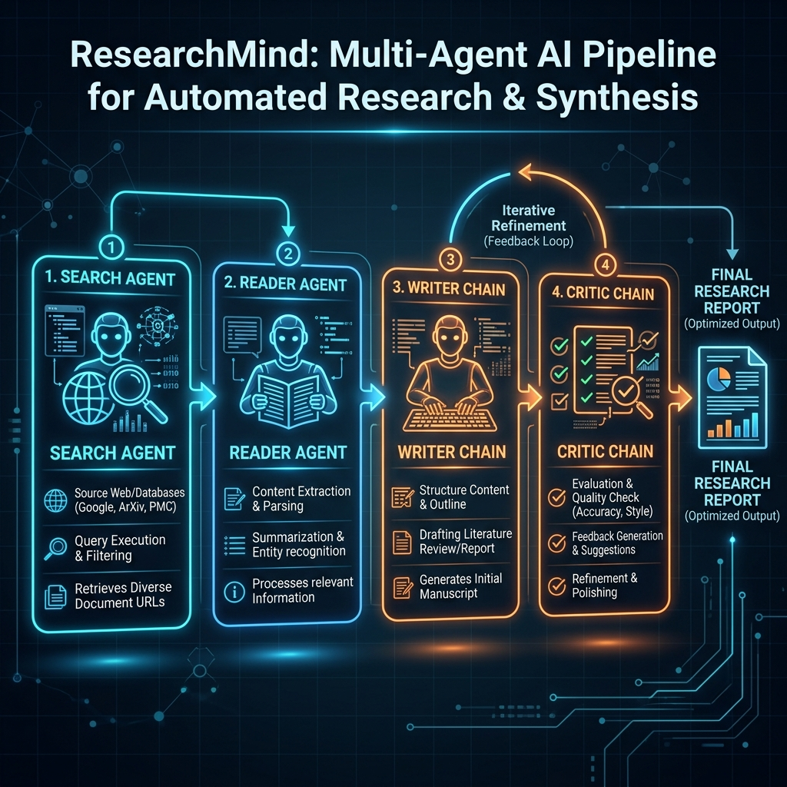
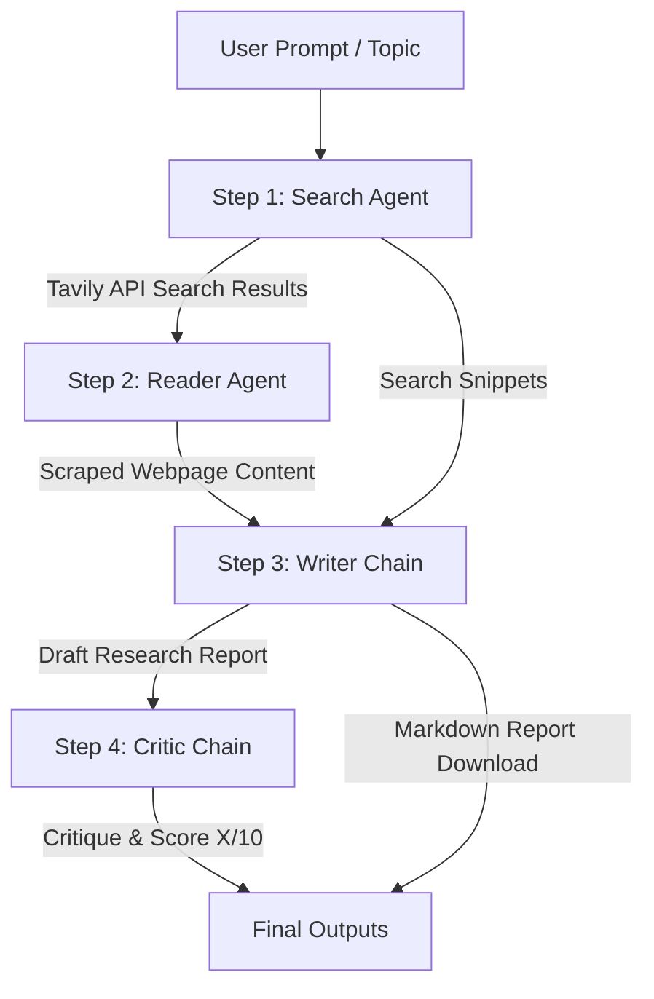

# ResearchMind 🔬 · Multi-Agent AI Research System



ResearchMind is an elegant, cooperative multi-agent research pipeline that automates the collection, extraction, synthesis, and critical evaluation of information on any given topic. By orchestrating specialized AI agents and LLM chains, ResearchMind creates comprehensive, factual, and structured research reports in markdown format.

> [!NOTE]
> For a deep-dive file walkthrough, API definitions, and complete code-level explanations, please refer to the [DOCUMENTATION.md](file:///c:/Users/ASUS/OneDrive/Documents/VSCODE/MultiAgentSystem/DOCUMENTATION.md) file.

---

## 🎨 Graphical Abstract

Below is the visual concept and execution flow of the ResearchMind Multi-Agent system:



---

## 🏗️ System Architecture & Data Flow

The system uses a sequential multi-agent workflow where the output of one step feeds into the next. 



### The 4 Collaborative Stages
1. **🔍 Search Agent (Agent)**: Uses the `web_search` tool to search the internet via the Tavily Search API. It returns titles, URLs, and snippets of the top 5 most relevant pages.
2. **📄 Reader Agent (Agent)**: Takes the search results, analyzes them to pick the single most relevant URL, and uses the `scrape_url` tool to retrieve the raw HTML. It parses, cleans, and returns up to 3,000 characters of clean content.
3. **✍️ Writer (LLM Chain)**: Consolidates the initial search results and the detailed scraped page contents to draft a structured Markdown report containing an Introduction, 3+ Key Findings, a Conclusion, and listed Sources.
4. **🧐 Critic (LLM Chain)**: Acts as an editor to critique the drafted report. It assigns a score out of 10, lists strengths/areas of improvement, and provides a one-line verdict.

---

## 🛠️ Technology Stack

The project leverages modern AI engineering and web frameworks:

*   **Core LLM Framework**: [LangChain](https://github.com/langchain-ai/langchain) (`langchain`, `langchain-core`, `langchain-community`, `langchain-mistralai`) using the `mistral-large-latest` model.
*   **Agent Construction**: LangChain's standard ReAct graph agent standard.
*   **Web Search API**: [Tavily Search](https://tavily.com/) (`tavily-python`) for developer-optimized search results.
*   **Web Scraping & Parsing**: `BeautifulSoup4` and `requests` for fetching and cleaning raw HTML.
*   **Frontend UI**: Single Page Application built with vanilla HTML5, CSS3 (custom CSS variables, repeating dot grid background, cursor spotlight glow, animations), and JavaScript (NDJSON streaming client and marked.js for Markdown rendering).
*   **Backend Server**: FastAPI & Uvicorn (hosts API endpoints and streams NDJSON events).
*   **Utility**: `rich` (CLI terminal formatting), `python-dotenv` (environment variables), and `pydantic` (data validation).

---

## ⚙️ Project Setup & Installation

### 1. Clone & Navigate
```bash
git clone https://github.com/Sayan-Official-32/ResearchMind.git
cd ResearchMind
```

### 2. Set Up a Virtual Environment
Create and activate a Python virtual environment:
```powershell
# Windows
python -m venv .venv
.venv\Scripts\activate

# macOS / Linux
python3 -m venv .venv
source .venv/bin/activate
```

### 3. Install Dependencies
```bash
pip install -r requirements.txt
```

### 4. Configure Environment Variables
Create a `.env` file in the root directory and add your API keys:
```env
TAVILY_API_KEY="your-tavily-api-key"
MISTRAL_API_KEY="your-mistral-api-key"
```

> [!IMPORTANT]  
> The codebase instantiates `ChatMistralAI(model="mistral-large-latest")` which requires a `MISTRAL_API_KEY` in your `.env` file.

---

## 🚀 How to Run

You can run ResearchMind in two ways:

### A. FastAPI Server (Web Application & API)
Launch the server to host both the elegant visual Web Application and the API endpoints:
```bash
python app.py
```
*or*
```bash
uvicorn app:app --reload --port 8000
```
*   **Web App**: Open your browser and navigate to `http://localhost:8000/` to use the interactive single-page application with real-time pipeline visualization.
*   **API Docs**: Interactive Swagger documentation is available at `http://localhost:8000/docs`.

#### Streaming API Request:
The client requests NDJSON events by making a POST request:
```bash
curl -X POST http://localhost:8000/research/stream \
  -H "Content-Type: application/json" \
  -d '{"topic": "Quantum computing breakthroughs 2025"}'
```

### B. Command Line Interface (CLI)
Run the script directly in your terminal:
```bash
python pipeline.py
```
*Enter a research topic when prompted. The step-by-step progress and final report will print in the console.*

---

## 📂 Repository Structure

```
├── .venv/                 # Local python virtual environment
├── .env                   # Configuration file (API keys)
├── requirements.txt       # Project dependencies
├── tools.py               # Custom tools (web_search, scrape_url)
├── agents.py              # Agent graphs & LLM chain configurations
├── pipeline.py            # Sequential orchestration logic (CLI entrypoint & generator)
├── app.py                 # FastAPI server (serves API & SPA frontend)
├── static/                # Single Page Application assets
│   ├── css/style.css      # Premium UI stylesheet with cursor spotlight glow
│   ├── js/app.js          # Live NDJSON streaming & state controller
│   └── index.html         # HTML layout
├── DOCUMENTATION.md       # Developer documentation (code walkthroughs)
├── project_concept.md     # Project idea & design philosophy
└── README.md              # Project documentation (this file)
```

---

## 👥 Contributors & Credits
*   **LangChain** for multi-agent capabilities.
*   **Tavily API** for search services.
*   **FastAPI** for hosting the backend endpoints and serving the Single Page Web Application.
