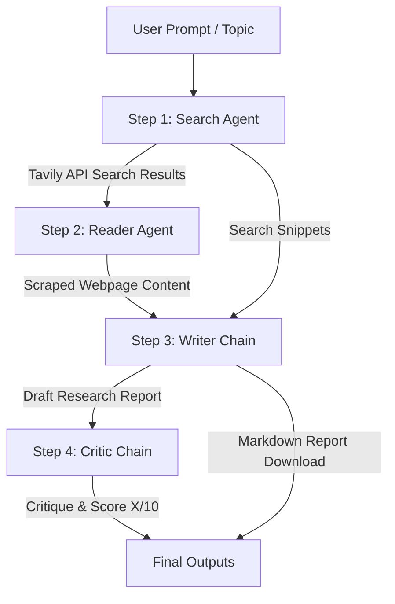

# ResearchMind 🔬 · Multi-Agent AI Research System


ResearchMind is an elegant, cooperative multi-agent research pipeline that automates the collection, extraction, synthesis, and critical evaluation of information on any given topic. By orchestrating specialized AI agents and LLM chains, ResearchMind creates comprehensive, factual, and structured research reports in markdown format.

It includes both a **Streamlit Web Application** with real-time pipeline visualization and a **Command Line Interface (CLI)** script.

---

## 🏗️ System Architecture & Data Flow

The system uses a sequential multi-agent workflow where the output of one step feeds into the next. 



### The 4 Collaborative Stages
1. **🔍 Search Agent (Agent)**: Uses the `web_search` tool to search the internet via the Tavily Search API. It returns titles, URLs, and snippets of the top 5 most relevant pages.
2. **📄 Reader Agent (Agent)**: Takes the search results, analyzes them to pick the single most relevant URL, and uses the `scrape_url` tool to retrieve the raw HTML. It parses, cleans, and returns up to 3,000 characters of clean content.
3. **✍️ Writer (LLM Chain)**: Consolidates the initial search results and the detailed scraped page contents to draft a structured Markdown report containing an Introduction, 3+ Key Findings, a Conclusion, and listed Sources.
4. **🧐 Critic (LLM Chain)**: Acts as an editor to critique the drafted report. It assigns a score out of 10, lists strengths/areas of improvement, and provides a one-line verdict.

---

## 🛠️ Technology Stack

The project leverages modern AI engineering and web frameworks:

*   **Core LLM Framework**: [LangChain](https://github.com/langchain-ai/langchain) (`langchain`, `langchain-core`, `langchain-community`, `langchain-openai`)
*   **Agent Construction**: LangChain's new `create_agent` graph compilation standard.
*   **Web Search API**: [Tavily Search](https://tavily.com/) (`tavily-python`) for developer-optimized search results.
*   **Web Scraping & Parsing**: `BeautifulSoup4`, `lxml`, and `requests` for fetching and cleaning raw HTML.
*   **Frontend UI**: [Streamlit](https://streamlit.io/) with a fully customized theme (dark palette, HSL radial gradients, responsive grids, CSS micro-animations, and interactive pipeline steps).
*   **Utility & Styling**: `rich` (CLI terminal formatting), `python-dotenv` (environment variables), and `pydantic` (data validation).

---

## ⚙️ Project Setup & Installation

### 1. Clone & Navigate
```bash
git clone <your-repo-url>
cd MultiAgentSystem
```

### 2. Set Up a Virtual Environment
Create and activate a Python virtual environment:
```powershell
# Windows
python -m venv .venv
.venv\Scripts\activate

# macOS / Linux
python3 -m venv .venv
source .venv/bin/activate
```

### 3. Install Dependencies
```bash
pip install -r requirements.txt
```

### 4. Configure Environment Variables
Create a `.env` file in the root directory and add your API keys:
```env
TAVILY_API_KEY="your-tavily-api-key"
OPENAI_API_KEY="your-openai-api-key"
```

> [!IMPORTANT]  
> The codebase instantiates `ChatOpenAI(model="gpt-4o-mini")` which requires an `OPENAI_API_KEY`. Please ensure `OPENAI_API_KEY` is present in your `.env` file. (If you want to use another provider like Mistral, update `agents.py` to instantiate `ChatMistralAI` instead).

---

## 🚀 How to Run

You can run ResearchMind in two ways:

### A. Streamlit Web App (Recommended)
Launch the beautiful browser interface with real-time pipeline status:
```bash
streamlit run app.py
```
*Open your browser and navigate to `http://localhost:8501`.*

### B. Command Line Interface (CLI)
Run the script directly in your terminal:
```bash
python pipeline.py
```
*Enter a research topic when prompted. The step-by-step progress and final report will print in the console.*

---

## 📂 Repository Structure

```
├── .venv/                 # Local python virtual environment
├── .env                   # Configuration file (API keys)
├── requirements.txt       # Project dependencies
├── tools.py               # Custom tools (web_search, scrape_url)
├── agents.py              # Agent graphs & LLM chain configurations
├── pipeline.py            # Sequential orchestration logic (CLI entrypoint)
├── app.py                 # Streamlit frontend & web-orchestrator
└── README.md              # Project documentation (this file)
```

---

## 👥 Contributors & Credits
*   **LangChain** for multi-agent graph capabilities.
*   **Tavily API** for search services.
*   **Streamlit** for the frontend engine.
